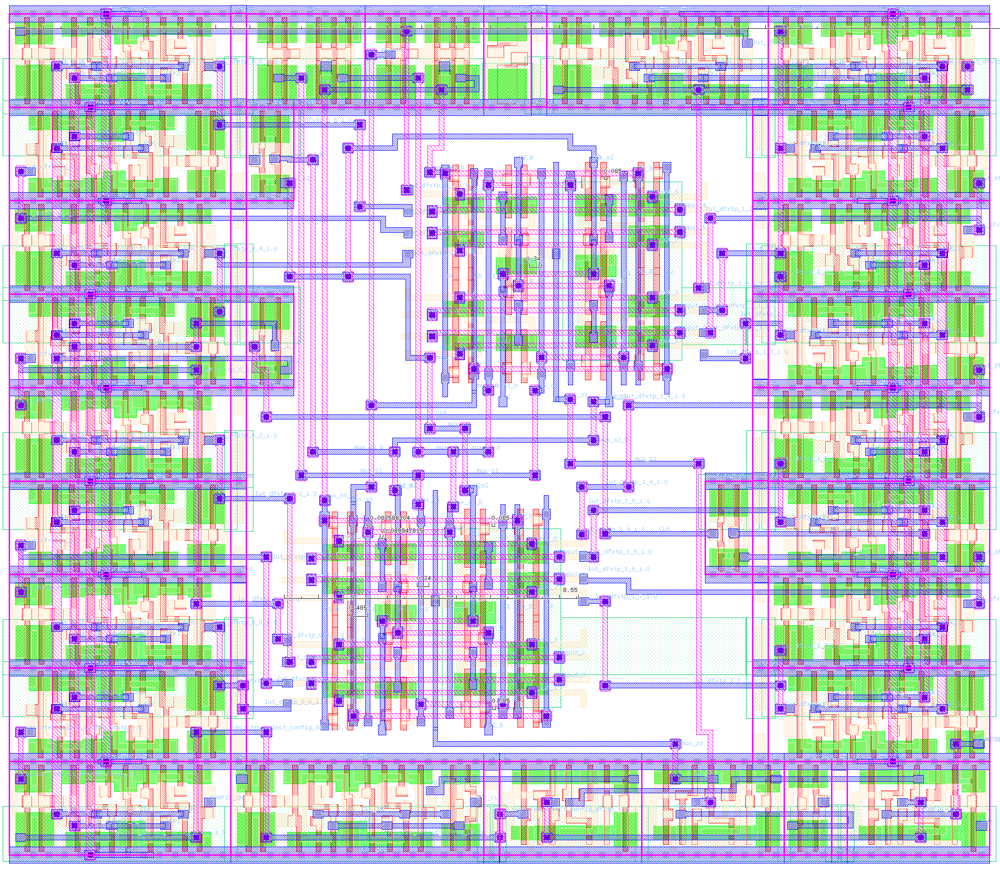
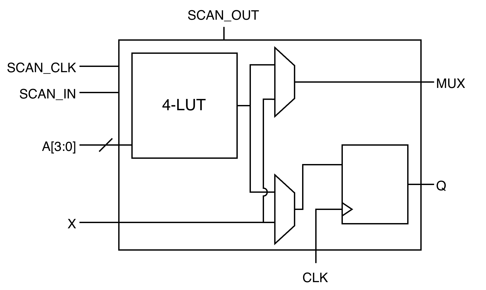
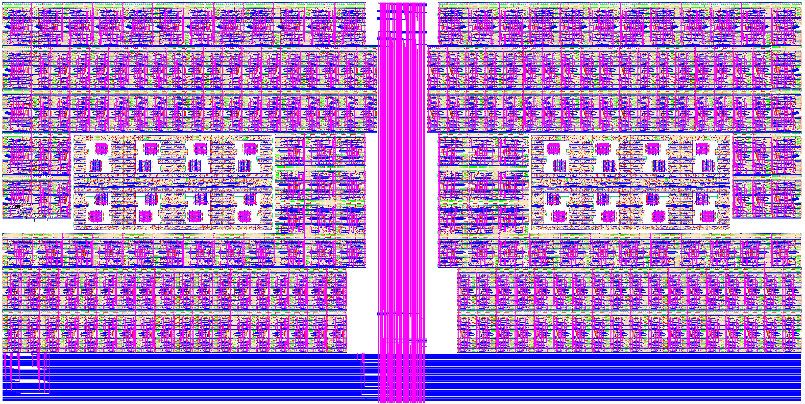

# BFG

BFG is an open-source full-custom silicon compiler for high-performance FPGA fabrics. BFG makes FPGA IP. It works by hierarchically composing parameterised layout and circuit generators.

[](https://doi.org/10.5281/zenodo.20349466)

Here is a Configurable Logic Block based around a 4-LUT for Skywater 130nm, produced by the [LutB](src/tiles/lut_b.h) generator:



It can register either the LUT output or its bypass input. A combinational output pin also lets you select between the LUT output and the bypass, as in:

'

The CLB itself is made up of generators for [flip-flops](src/atoms/sky130_dfxtp.h), a [hierarchical transmission-gate mux](src/atoms/sky130_mux.h), two [different](src/atoms/sky130_buf.h) [buffer](src/atoms/sky130_split_buffer.h) topologies and [active 2:1 muxes](src/atoms/sky130_hd_mux2_1.h). Some of these are taken from the open-source [sky130_fd_sc_hd](https://sky130-unofficial.readthedocs.io/en/latest/contents/libraries/sky130_fd_sc_hd/README.html) library and then parameterised, others were made from scratch.

BFG can then [assemble](src/tiles/s44.h) an S-44 LUT based around this CLB and a [carry chain](src/atoms/sky130_carry1.h). Together with [N:1](src/atoms/sky130_interconnect_mux1.h) and [N:2 (shared) multiplexer generators](src/atoms/sky130_interconnect_mux2.h) for interconnect wiring, and wire buses with configurable break-outs, this is enough to assemble a whole FPGA tile:



## Status

BFG works, but has sharp edges. Because it is gradware and I am but one man. Also, even now that we have magical AI, it is bad a lot of the hard parts. Designs are DRC-clean enough to pass LVS, so we can measure their performance and compare it to the popular method of synthesising FPGAs from standard cells.

We think this is how open-source FPGAs should be built, even if it is hard. So I implore you to use, criticise, and contribute to this software!

## Usage

BFG relies on [VLSIR](https://github.com/Vlsir/Vlsir) for producing common formats like LEF/DEF, GDS and (the various) Spices. 

Once BFG and the prerequisites are [installed](INSTALL.md)) with:

```
$ cd build
$ ./bfg
  --jobs 0  \
  --technology ../sky130.technology.pb \
  --primitives ../sky130.primitives.pb \
  --external_circuits ../sky130hd.pb \
  --logtostderr \
  --write_text_format \
  --run_generator LutB \
  --params LutB.params.pb.txt \
  --output_library LutB
```

This will produce `LutB.library.pb`, a binary-format protocol buffer [describing the layout]([url](https://github.com/Vlsir/Vlsir/blob/194c7a76f01e02e246f8cde822f195e02168c64e/protos/layout/raw.proto)), and `LutB.package.pb`, a binary-format protocol buffer [describing the circuit netlist]([url](https://github.com/Vlsir/Vlsir/blob/194c7a76f01e02e246f8cde822f195e02168c64e/protos/circuit.proto)).

The generator parameter file (`LutB.params.pb.txt`) is a text-format protocol buffer specifying the options for a particular generator according to the definitions in the [parameter proto file](proto/parameters/lut_b.proto).

To get a GDS, you need [proto2gds]([https://github.com/](https://github.com/dan-fritchman/Layout21/blob/52f5be0414cc724bac44b74ab2ae5bfcee75b233/layout21converters/src/bin/proto2gds.rs) from Layout21:

```
$ /path/to/Layout21/target/debug/proto2gds --verbose -i /path/to/LutB.library.pb -t /home/arya/src/bfg/sky130.technology.pb -o ${GENERATOR}.gds
```

To get spice, run `simulation/netlist.py`:

```
$ cd simulation
$ ./netlist.py /path/to/LutB.package.pb LutB.sp
```

## Installation

See [INSTALL.md](INSTALL.md).
