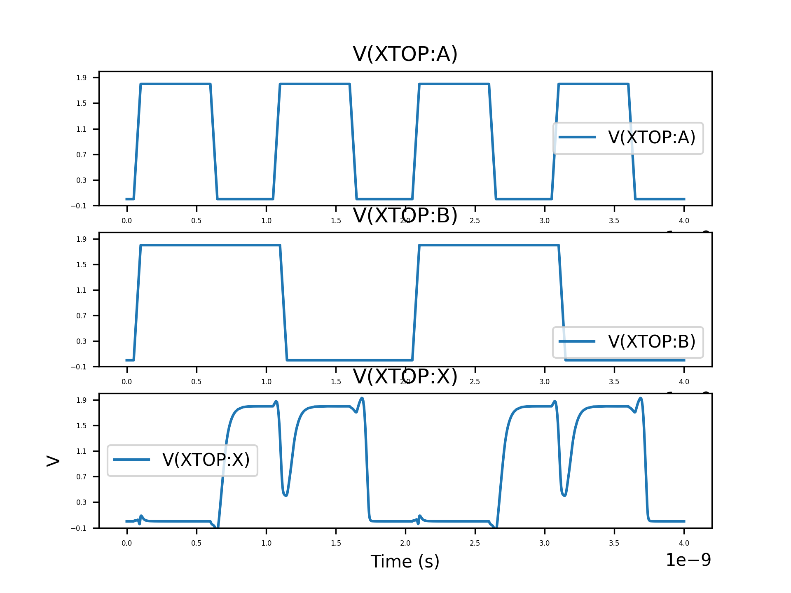

# Simulations

Here we keep some very convenient simulation scripts, based on Hdl21 and VLSIR.

However, there are limitations. Notably, not all simulator primitives are
exposed through Hdl21 yet (like `PATTERN`), so more sophisiticated tests are not
possible. For that we have to manually craft separate decks.

## TL;DR

To convert a BFG circuit in protobuf format to Spice, use `netlist.py`:
```
./netlist.py ../build/LutB.package.pb LutB.sp
```
Note that you need to scale all model params by 1E6 for Sky130!

To run Hdl21-based simulation flow:
```
PYTHONPATH=~/src/Hdl21:~/src/Hdl21/pdks/Sky130 python3 sky130_xor2.py
```

## Prerequisites

## LutB

## Sky130Mux

## Sky130Xor2


